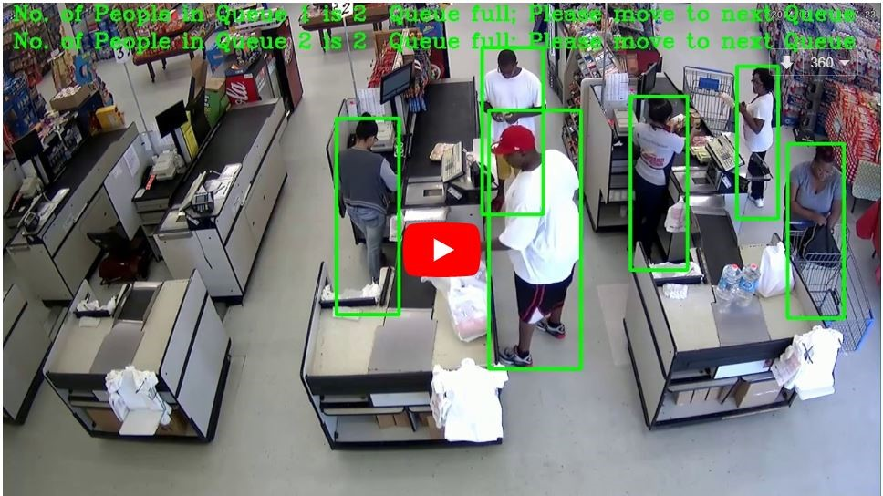
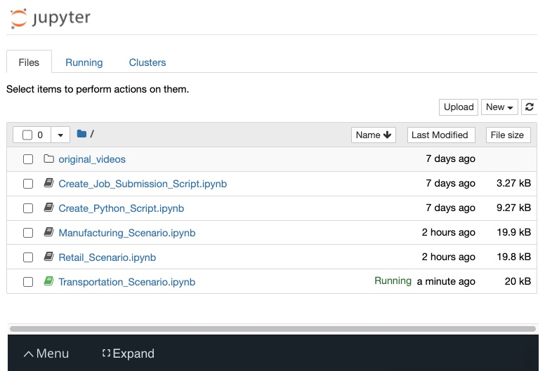
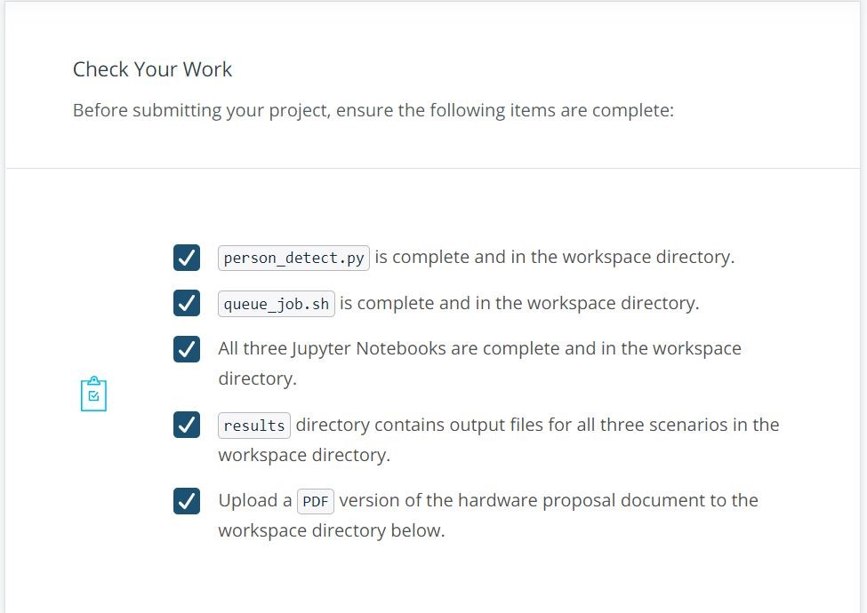

   

# Smart Queuing System – Project Overview

## Main Tasks
The following pages will walk you through the steps of the project. At a high level, you will:

## Propose a possible hardware solution
Build out your application and test its performance on the DevCloud using multiple hardware types
Compare the performance to see which hardware performed best
Revise your proposal based on the test results

## Part 1: Hardware Proposal
The Scenarios
We've provided three different scenarios that depict real-world problems based on different sectors where edge devices are typically deployed.

The three scenarios you'll be looking at are:

Scenario 1: Manufacturing Sector
Scenario 2: Retail Sector
Scenario 3: Transportation Sector
If you look at the pages immediately after this one, you'll see that there's one page for each of these scenarios.

## Hardware Proposal
All of the scenarios involve people in queues, but each scenario will require different hardware. So your first task will be to determine which hardware might work for each scenario—and then explain your initial choice in a proposal document (see below).

Later, after you've built and tested your application on each hardware device for all three scenarios, you'll review the results and validate or update your initial proposed choices in the proposal document.

# Scenario 1: Manufacturing Sector
Below is the first scenario. Your job is to read through the scenario and figure out which type of hardware might best fit the client's needs. You'll see that this is similar to scenarios you practiced with earlier in the course.

The scenario is pretty long and not all of the information is important! That's intentional and not unlike what you'll encounter when working with real clients. This is an opportunity to demonstrate that you know which pieces of information are relevant when selecting hardware, and which are unimportant or unrelated.

The Scenario
Mr. Vishwas is the VP of Engineering at Naomi Semiconductors, a manufacturer known for its industrial-grade standard in producing semiconductor chips. Recently, the company has been venturing into Intel Pentium 4/3000 chip production—and they want to maximize their revenue in this venture. Their other chips in the last year have earned them two million dollars alone. With such good revenue, their expansion into the Intel Pentium 4/3000 industry is an obvious next step.

There are several steps involved in the chip manufacturing process:

Step 1: Produce a silicon ingot
Step 2: Create blank wafers
Step 3: Use these wafers to reproduce a patterned wafer
Step 4: Create and test dies
Step 5: Assemble bond dies into packages
Step 6: Test packaged dies
Step 7: Ship dies to customers
Mr. Vishwas explains that there have been several roadblocks in this pipeline. The entire process should take around 6 to 8 weeks—but currently, it is taking 10 to 12 weeks. This is reducing their revenue by 30%.

Mr. Vishwas has noticed that Step 7 (shipping to customers) seems to be taking the most time. This part of the process involves the manual labor of packaging the chips into boxes. There is one particular shop floor—which has two industrial belts—that has shown slower production than the rest.

Workers alternate shifts to keep the floor running 24 hours a day so that packaging continues nonstop, but Mr. Vishwas has noticed a slow-down in production during the shift transition periods. Between shifts, he has observed a 70% dip in the production rate of packaged containers.

To help understand and address these issues, Mr. Vishwas wants a system to monitor the number of people in the factory line. The factory has a vision camera installed at every belt. Each camera records video at 30-35 FPS (Frames Per Second) and this video stream can be used to monitor the number of people in the factory line. Mr. Vishwas would like the image processing task to be completed five times per second.

Once this productivity problem has been addressed, Mr. Vishwas would like to be able to repurpose the system to address a second issue. The second issue Mr. Vishwas has encountered is that a significant percentage of the semiconductor chips being packaged for shipping have flaws. These are not detected until the chips are used by clients. If these flaws could be detected prior to packaging, this would save money and improve the company's reputation.

To be able to detect chip flaws without slowing down the packaging process, the system would need to be able to run inference on the video stream very quickly. Additionally, because there are multiple chip designs—and new designs are created regularly—the system would also need to be flexible so that it can be reprogrammed and optimized to quickly detect flaws in different chip designs.

While Naomi Semiconductors has plenty of revenue to install a quality system, this is still a significant investment and they would ideally like it to last for at least 5-10 years.

# Scenario 2: Retail Sector
Below is the second scenario. Again, your job is to read through the scenario and figure out which type of hardware might best fit the client's needs.

The Scenario
PriceRight Singapore has one of its smaller outlets in the tiny neighborhood of Dover. Mr. Lin is the store manager—and like any good store manager, he wants to use Edge AI to help maximize his profit this year.

Most of the customers are regulars at the store. Mr. Lin has seen an average of about 200 people in the store during weekdays. On the weekends, this increases to between 500 and 1000. The maximum number of people visit the store during the holidays. Most customers spend 30-50 mins in the store during a single visit. Out of this, they have an average wait time of 230 seconds at the checkout counters. But on the weekends, the wait time can increase substantially. The average time spent is 40 mins at the store and 350-400 seconds at the checkout line.

The total number of people in the checkout queue ranges from an average of 2 per queue (during normal daily hours) to 5 per queue (during rush hours).

It is during rush hours that Mr. Lin has seen wavering sales. When wait times are short and checkout happens smoothly, he sees a jump in his revenue from 6 to 20%. However, if there is congestion at the checkout counter, his profits only go up to 4-5%.

Mr. Lin believes this problem can be easily solved by directing people to less-congested queues in the store, and he is interested in using an Edge AI system to do so.

Most of the store's checkout counters already have a modern computer, each of which has an Intel i7 core processor. Currently these processors are only used to carry out some minimal tasks that are not computationally expensive.

Mr. Lin employs close to 300 employees, including staff that work in transportation, on the store floor, and at the checkout counter. Although the store's annual sales are $7 million in food alone, the net profit is only about 1.1% of this. Mr. Lin also believes in giving fair employment and good wages. He pays his staff with proper salaries, along with substantial bonuses twice a year. As a result, Mr. Lin does not have much money to invest in additional hardware, and also would like to save as much as possible on his electric bill.

# Scenario 3: Transportation
Below is the third scenario. Again, your job is to read through the scenario and figure out which type of hardware might best fit the client's needs.

The Scenario
Ms. Leah is the Innovation head for Delhi Metro Rail Services. Delhi Metro is an urban passenger transportation system connecting Ghaziabad, Faridabad, Gurgaon, Noida, Bahadurgarh, and Ballabhgarh in the National Capital Region of India. Delhi Metro makes 2,700 trips every day and is one of the busiest metros in India.

During peak hours, some areas of the platform get highly congested, while other areas remain relatively open. In some cases, passengers trying to board in the more congested areas are unable to get on, even though there is space on the train.

Currently, this congestion is handled manually by door operators, who help direct passengers to less congested areas during peak time. Ms. Leah would like to automate this using an Edge AI system that would monitor the queues in real-time and quickly direct the crowd in the right manner.

In peak hours they currently have over 15 people on average in a single queue outside every door in the Metro Rail. But during non-peak hours, the number of people reduces to 7 people in a single queue. On office hours there is a train every 2 mins. However, on the weekends the time increases to up to 5 mins since some of their drivers work only 5 days a week.

They monitor the entire situation with 7 CCTV cameras on the platform. These are connected to closed All-In-One PCs that are located in a nearby security booth. The CPUs in these machines are currently being used to process and view CCTV footage for security purposes and no significant additional processing power is available to run inference. Ms. Leah's budget allows for a maximum of $300 per machine, and she would like to save as much as possible both on hardware and future power requirements.

# Testing Your Hardware
Now that you have an initial hypothesis about what hardware might work for the client, it's time to test it and see how it performs!

Over the next several pages, you'll find notebooks where you can build out the smart queuing application and test its performance on all four different hardware types (CPU, IGPU, VPU, and FPGA) using the DevCloud.

## Shared Workspace

The next several pages each show a different Jupyter notebook for you to work on. Although these appear to be different workspaces, these notebooks—along with the files generated by your code—are all inside one shared workspace. If you click on the Jupyter icon in the upper left, you will be able to see all of the notebooks:

A screenshot showing the upcoming workspace with all of the notebooks available.
That means that all of your files are available, regardless of which page you're on—and that any changes you make on one page will show up on the other pages.

⚠️ If you use the Reset Data or Get New Content options on any of the following pages, be aware that this will reset the data in the entire shared workspace (regardless of which page you are on when you reset the data).

## Stand-Out Suggestions
Once you're done with all of the required parts of your project, you can take it a step further and tinker with a few other hardware features! You can try out these standout suggestions. Note that these are all optional and are not required to pass the project.

There are some pointers given below. These will help you implement the stand out suggestions in your project

1. Multi-Device Plugin: Multi-Device plugin automatically assigns inference requests to available computational devices to execute the requests in parallel. You can use the multi-device plugin available as a part of the OpenVINO toolkit. When you submit your project, leave a brief note for your reviewer letting them know how you used the plugin.

The information or documentation on this can be found here
2. Heterogeneous Plugin: The heterogeneous plugin enables computing for inference on one network on several devices. You can use OpenVINO's Hetero plugin to use a fallback device like CPU when the main prediction device fails. When you submit your project, leave a brief note for your reviewer letting them know how you used the plugin.

More information regarding default or manual Fallback Policy can be found here

# conclusion

Upload your Proposal Document
You will need to upload a PDF version of your hardware proposal document to the workspace directory. This can be done by clicking on the upload button on the top right corner of the workspace below.

